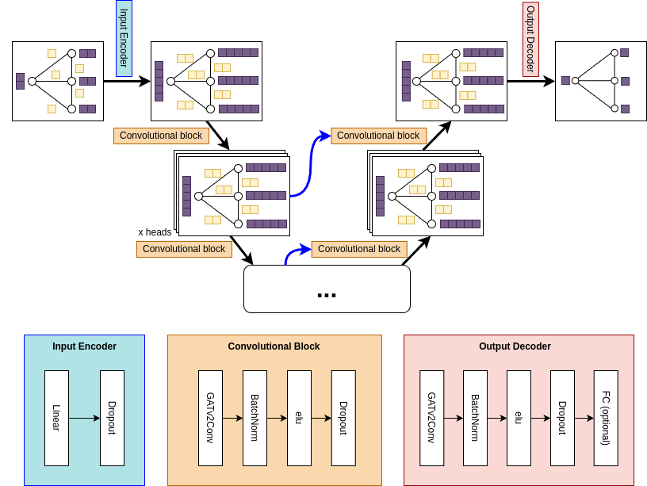
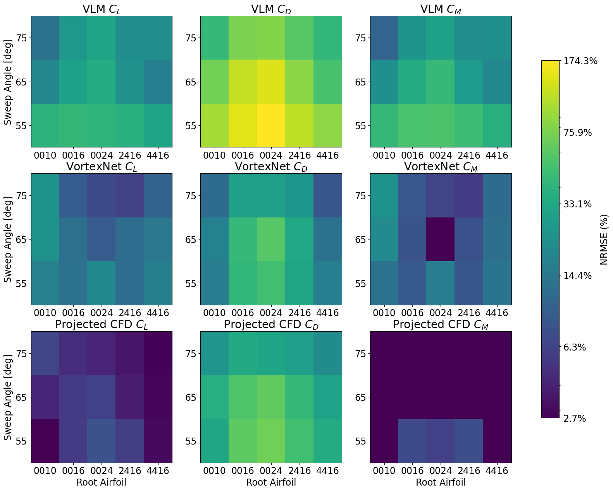
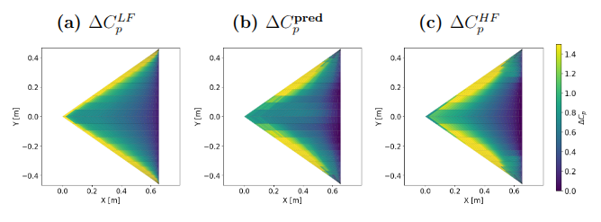
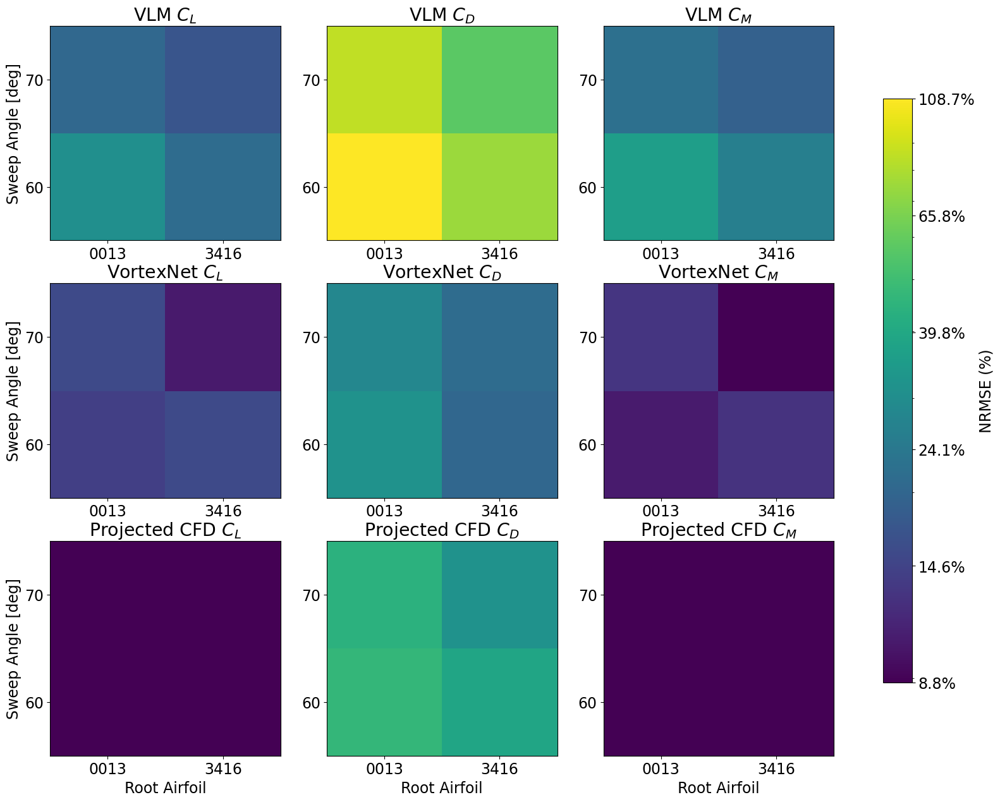
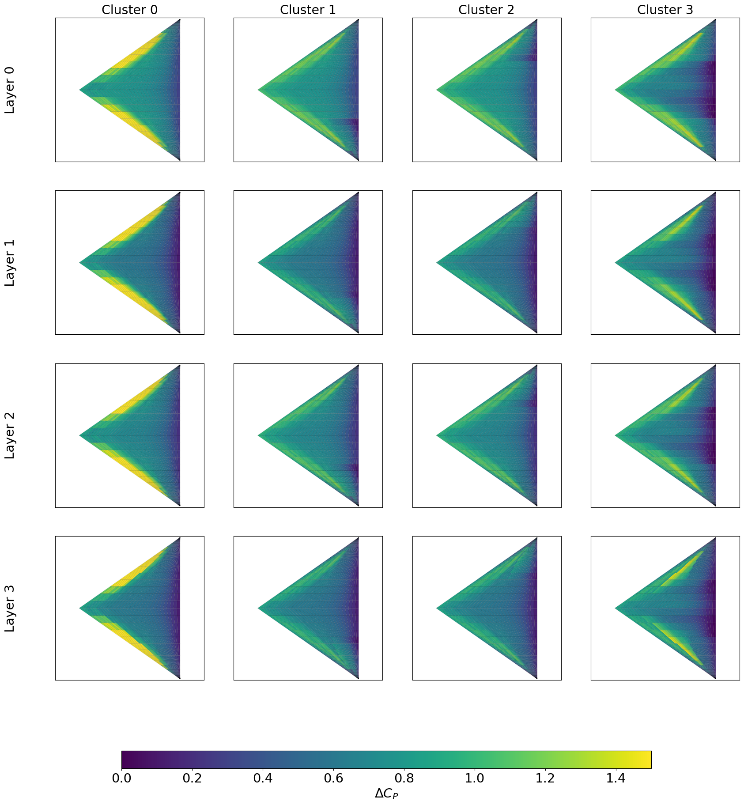

# MF-VortexNet
**Graph Neural Network-Based Multi-Fidelity Correction to Vortex Lattice Method. Please see the paper INSERT DOI.**

Yiren Shen (yrshen@stanford.edu), Jacob T. Needels, Juan J. Alonso

# 🔍 Highlights

- 🧠 **GNN-Based Surrogate**: Learns panel-wise pressure field corrections from CFD to enhance VLM predictions.
- 📊 **threefold Accuracy Improvement**: Achieves up to 3x reduction in normalized root mean square error (NRMSE) for aerodynamic coefficients.
- 📐 **Geometry Generalization**: Demonstrates robust prediction performance across unseen delta wing geometries.
- 🧪 **Physics-Informed Training**: Includes physical loss terms and latent space ablation for model interpretability and robustness.
- Predicts panel-wise pressure distribution (`∆Cp`) with high fidelity.
- Generalizes well to unseen configurations with moderate geometric variations.
- Compatible with existing conceptual design and MDO frameworks ([SUAVE](https://github.com/suavecode/SUAVE)).

# Environment
  ## 1. Library:
    pip install -r requirements.txt
  ## 2. SUAVE: 
    [SUAVE Install](https://suave.stanford.edu/download/standard_install.html)

# Content

## 1. ./VortexNet
VortexNet library with data structure (`MFData.py`), network (`model.py`), training (`training.py`), and utility functions (`VortexNetUtils.py`) included.

## 2. ./dataset
Tabulated dataset in `.pkl`. Data structure is defined in `MFData.py`.

### ./dataset/train_set
Data used for network training for the following delta wings.  
The free-stream conditions are included in the `./freestream_configurations` files.

| Sweep [deg] | Airfoil [NACA]                 | Free-stream conditions                 |
|-------------|--------------------------------|----------------------------------------|
| 55          | 0010, 0016, 0024, 2416, 4416   | See corresponding configuration files |
| 65          | 0010, 0016, 0024, 2416, 4416   | See corresponding configuration files |
| 75          | 0010, 0016, 0024, 2416, 4416   | See corresponding configuration files |

### ./dataset/new_geom
Data used for generalizability testing on new delta wings.  
Free-stream conditions are included in the `./freestream_configurations` files.

| Sweep [deg] | Airfoil [NACA] | Free-stream conditions                 |
|-------------|----------------|----------------------------------------|
| 60          | 0013, 3416     | See corresponding configuration files |
| 70          | 0013, 3416     | See corresponding configuration files |

### ./dataset/freestream_configurations
Free-stream conditions for both CFD and VLM runs.  
Each row contains: test index, AOA, Mach number, Reynolds number.

## 3. ./scripts
- `search_hp_for_deltawing.py`: Script for hyperparameter optimization using Optuna.

# Abstract

Aircraft design relies on accurate aerodynamic predictions. High-fidelity (HF) methods, such as computational fluid dynamics (CFD), provide accurate predictions of aerodynamic loads but are computationally expensive for early-stage design. Conversely, low-fidelity (LF) methods, such as the vortex lattice method (VLM), offer rapid solutions with low computational cost but struggle to capture complex flow phenomena, limiting their predictive accuracy. The conceptual design process thus presents a fidelity-cost trade-off, requiring a balance between HF and LF data in early design phases. This study proposes a multi-fidelity conceptual design analysis workflow that integrates a graph neural network (GNN)-based physics-informed, lightweight trainable surrogate model, **VortexNet**, into the VLM to augment the analysis fidelity of LF tools. The surrogate model learns corrections to LF panel-wise pressure field data using data-driven insights from HF CFD simulations, thus allowing accurate and efficient aerodynamic analyses on arbitrary quantities of interest.

When the proposed workflow is used for performance assessment for various Delta wing geometries under low speed and high angle of attack (AOA), the surrogate model VortexNet demonstrates strong prediction accuracy and generalizability across geometries and free-stream conditions, and effectively captures the nonlinear flow features under geometric variations. Compared with using VLM alone, the multi-fidelity analysis workflow achieves a **threefold reduction in the normalized root mean square error (NRMSE)** for the predicted aerodynamic coefficients. A prediction mechanism explanation, leveraging the **latent space ablation** technique, is conducted to rationalize the model’s predictive capabilities and provide guidance for future improvements in VortexNet-like surrogate modeling. These results indicate that the proposed multi-fidelity workflow, leveraging the surrogate model VortexNet, has the potential as a valuable tool for design fidelity improvement in conceptual design.

# High-level Overview

## 🚀 Goal

Improve the accuracy and efficiency of aerodynamic predictions in **conceptual aircraft design** by integrating:
- **Low-fidelity (LF)** models like the Vortex Lattice Method (VLM)
- **High-fidelity (HF)** models like CFD (RANS)
- A **graph neural network (GNN)**-based surrogate model called **VortexNet**
into a conceptual aircraft design environment [SUAVE](https://github.com/suavecode/SUAVE).
---

## 🧠 Why It Matters

- **CFD** is accurate but too **computationally expensive** for early-stage design.
- **VLM** is fast but **fails to capture nonlinear phenomena** (e.g., vortex lift, flow separation).
- Conceptual design needs a **trade-off between speed and fidelity**.
- The proposed method brings **CFD-level accuracy** at **VLM-level cost** inside a design-evaluation cycle.

---

## 🛠️ Methods

- Designed a **GNN-based surrogate model** (VortexNet) that learns pressure field corrections from CFD data.
  
- Implemented a **multi-fidelity workflow** that augments VLM with GNN-predicted corrections.
- Used:
  - **Graph Attention Networks (GATv2)** with **U-Net-style architecture**
  - **k-fold cross-validation** training
  - **Physics-informed loss functions**
    The loss function combines SmoothL1Loss, SignLoss, and PhysicalLoss to train VortexNet. SmoothL1 minimizes error magnitude, SignLoss penalizes sign mismatches, and PhysicalLoss adds physics-informed constraints. The PhysicalLoss balances physics-driven accuracy and training efficiency, with all contributions controlled by tunable hyperparameters.

    $\mathcal{L} = \text{SmoothL1Loss} \left( q^{HF}, q^{\text{pred}} \right) + \Lambda \text{PhysicalLoss} \left( q^{\text{pred}}  \right) + \Omega \text{SignLoss} \left(q^{HF}, q^{\text{pred}} \right),$
    where the PhyscialLoss is:
    $\text{PhysicalLoss} (q^{\text{pred}}) = \lvert \lvert AIC \cdot \Gamma^{\text{pred}}(q^{\text{pred}}) - RHS \rvert \rvert.$

  - **Hyperparameter tuning** via [Optuna](https://github.com/optuna/optuna)

---

## 📊 Key Results

- Achieved a **3x reduction in NRMSE** for predicted aerodynamic coefficients over VLM alone.
    
- **Accurate prediction** of complex flow features like **vortex lift**.
    
- **Generalizes well** to **unseen geometries** and flow conditions.
    
- **Latent space ablation** used to interpret model behavior and validate learning.
    
---

## ✈️ Applications

- Conceptual aircraft design
- Multi-disciplinary design optimization (MDO)
- Surrogate modeling 
- Any low-cost, high-speed aerodynamic analysis tasks

---

## 🧩 Takeaway

**VortexNet bridges the gap between fast low-fidelity models and accurate high-fidelity simulations** enabling **faster**, **more accurate**, and **scalable** conceptual design with low-fidelity analysis tools.

---

# Citing MF-VortexNet
UPDATE PAPER DOI
